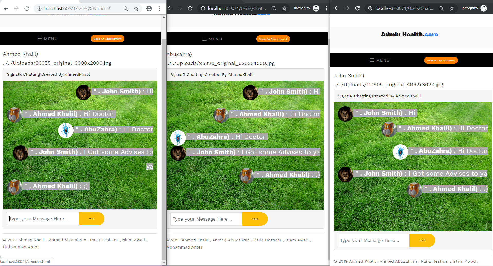

# HealthCareSystem_MVC_ASP-Master
---
## Team :
| Name   | Section |  Speciality |
| :-------------: | :-------------: |:----------:|
|Ahmed Khalil | sec(1) | Web 3.0 Splution Architect |
|Rana Hesham | sec(3) | Designer + HCI Analyst |
|Ahmed Abu Zahra | sec(1) | Designer +Analyst |
| Islam Awad | Sec(2) | Database Analyst& Designer |
| Mohammad Antar | Sec(4) | Database Analyst |

## Documentation
| Course | Doctor |  Documentation |
| :-------------: | :-------------: |:----------:|
|E-Business (SOA) | DR Haithem El Ghareep | [ASP MVC5 (SOA) BASED](https://github.com/AhmedKhalil777/HealthCareSystem_MVC_ASP-Master/blob/master/E-Business%20Documentation/E-Business%20Documentation.ipynb) |
|System Design  | DR Samir Abd El Razik| DB DESIGN , System Design |
|Network Programming |DR Sara Shaker | [Chatting Room Signalr](https://github.com/AhmedKhalil777/HealthCareSystem_MVC_ASP-Master/blob/master/Network%20Programming%20Documentation/ChattingRoom%20Documentation.ipynb) |
| HCI |Dr Mohammad Seiam | Contextual inquiry + Low Fadility +Requirement Analysis |
| Intelligent IS | DR Reiham Reda | ALPHA BETA Pruning Checkers Game |

 ---
 ## The Home Page of The User
 - 
 - 
 - 
 ---
 ##  Chatting Room Using Signalr Technology
 - 
 ---
 ## AI Game ALPHA BETA pruning --> Checkers
 - 
 ## Admin Pages To Modify The whole Data and Do CRUD Operations
 - 
